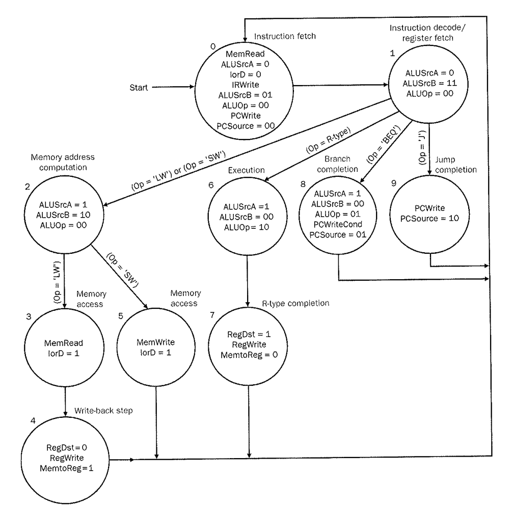
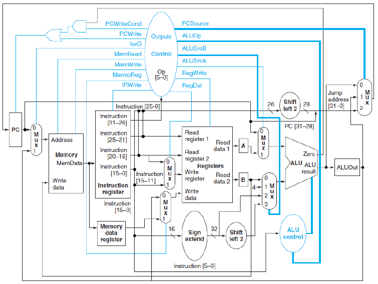

 

# INF2C-CS 2021/22 | CW2 MIPS Simulator

**Deadline:** Friday, 26th November (Week 10), 16:00  
**Instructors:** Boris Grot, Sam Ainsworth, Tobias Grosser  
**TA:** M.R. Siavash Katebzadeh  

The aim of this assignment is to write a simulator for a 5-stage multi-cycle MIPS processor.   
A simulator is a functional model of a processor that mimics the behaviour of a real processor but is written in a high level language.
Your simulator, written in C, will read a memory file consisting of MIPS instructions and data, “execute” the instructions and output the state of the processor and various statistics of the execution.   
To get you started, you will be provided with a skeleton implementation of the simulator that you will need to extend.   
You are strongly advised to read up on the MIPS processor in the lecture notes and course textbook and to commence work as soon as possible.


## 1) Download this coursework

First, you will need to **clone** the repository. If you used GitHub before (such as for CW1), you will already have either an HTTPS access token, or an SSH key. If you do not have either, you will need to create this (as in CW1).

  At this point, you can clone the repository:
  - if you used HTTPS above, use the command
    ```
    git clone https://github.com/edinburgh-teaching/REPOSITORY_NAME.git
    ```
  - if you used SSH, use the command
    ```
    git clone git@github.com:edinburgh-teaching/REPOSITORY_NAME.git
    ```
Now enter the repository directory: `cd REPOSITORY_NAME`. 


## 2) Overview
In this assignment, you are provided with a skeleton of the simulator, which includes the 5-stage MIPS processor and memory.
You will need to extend the provided code to support a set of specified MIPS instructions.
By reading from input files, the skeleton feeds the memory and register state file with instructions and data, and simulates the standard 5-stage instruction execution cycle. 
The output functions are already implemented and called in the skeleton.

### Skeleton Organization:
The skeleton is broken down into four source code files.
Each file accomplishes particular tasks. You are allowed to modify and submit only certain files.
The functionality and permission to modify for each file are described in the following table:

| Filename           | Functionality                                   | Modifiable |
|--------------------|-------------------------------------------------|------------|
| mipssim.c          | Multi-cycle MIPS processor (datapath + control) | **Yes**    |
| definitions.h      | Data structure definitions for datapath         | No         |
| mipssim.h          | Various control functions and definitions       | No         |
| memory_hierarchy.c | Memory hierarchy implementation                 | No         |
| parser.h           | Reading and parsing input files                 | No         |

*mipssim.c:*
This file describes the multi-cycle MIPS processor as studied in class. 
The processor consists of the following core components: PC, Pipeline registers (IR, A, B, MDR, and ALUOut), Programmer-visible registers (in the register file), ALU,  ALU  Control, and Control.

The processor's functionality can be broken down into the following logical stages:   
instruction_fetch,   
decode_and_read_RF,   
execute,   
memory_access and   
write_back.

Note that each stage updates some architectural or microarchitectural state. 
For instance, the instruction_fetch stage updates the IR. The write_back stage updates the RF. 
Furthermore, this file handles the Control component by implementing a finite state machine. 
The state machine can be found in a function named *FSM*.


*definitions.h:*
This file defines the following required data structures for the MIPS processor:
- *ctrl_signals*, which control the datapath and are updated on a cycle-by-cycle basis by the control FSM
- *instr_meta*, which stores information about the instruction currently stored in the IR
- *memory_stats_t*, which consists of memory stats for loads, stores and instruction fetches
- *pipe_regs*, which includes the PC and microarchitectural registers of the processor (IR, A, B, ALUOut and MDR). For convenience, we refer to these registers as *pipeline registers* to indicate that they are spread out over the datapath (unlike the programmer-visible registers, which are all located inside the register file).


On any given cycle, the complete state of the processor is stored in a structure of type *architectural_state*, variable name *arch_state*. 
This structure includes the current clock cycle since the start of execution (*clock_cycle*), state of the current instruction's execution (e.g., INSTR_FETCH or DECODE), current values of control signals (*control*) and memory stats (*mem_stats*). 
This structure also includes an array of *registers*, which models a register file, as well as the *memory*. 
Finally, *arch_state* also includes the pipeline registers, which are maintained in two *pipe_regs* structs: *curr_pipe_regs* and *next_pipe_regs*.
The former (*curr_pipe_regs*) is used within a cycle to *read* the value of a given register. 
Meanwhile, a value that needs to be written into a pipeline register at the end of the cycle should be stored in *next_pipe_regs*.
At the end of each clock cycle, *curr_pipe_regs* is updated with values from *next_pipe_regs*; this functionality is already provided for you.

**IMPORTANT:** your program must ensure that the state of the processor as represented by *arch_state* is correct on any given cycle. 
To accomplish that, you must maintain the *control* signals, *curr_pipe_regs*, *registers* and *memory*. 
These updates must happen inside the designated functions in *mipssim.c*.

*memory_hierarchy.c:* 
This file provides the memory interface via two functions:
*memory_read*, which is used for reading from memory and *memory_write*, which is used for writing to memory.
By default, reads and writes access the memory directly, i.e., there is no cache.


*parser.h:*
This file contains the implementations of reading instructions and data from input files.
The format of input files are described in Section 6.

## 3) Task 1 (10 points)
### Warm-up exercise 
In this task, your job is to complete the *get_instruction_type* function. This function takes an opcode as the input and return the type of the instruction with the given opcode.
Note that types are already defined in the *definitions.h* file, and that all *R type* instructions have *R_INST* as their opcode (including *ADD* and *SLT*). 
In this task, the skeleton reads the memory file and outputs the opcode and type of each instruction in the given memory file.

**There are more types here than the usual three (R, I and J). Please make sure to use the most specific type available in *definitions.h*.**


## 4) Task 2 (10 points)
### Finite State Machine  Decode



In this task, you are required to complete the Control implementation in *mipssim.c*.
In every cycle, the Control component controls the state of each stage of the processor using a finite state machine (FSM).
Figure 1 illustrates the FSM used in the Control component of the multi-cycle MIPS processor as discussed in class.
Note that the names of the states in Figure 1 may be different from the source files provided to you.
Each circle in Figure 1 corresponds to one state of the FSM and lists (1) the values for mux select signals that are set in that state, and (2) all enable signals that are set in that state.  
For instance, State 0 (i.e. *instruction fetch*) shows that enable signals *MemRead*, *IRWrite* and *PCWrite* must be set.

In the skeleton, a global struct named *arch_state* contains a value named *control* of type *struct ctrl_signals*, which contains the control signals generated by the Control component.


You **must use these signals** and complete the *decode* operation within the *FSM* function to control the second stage of the processor.
The FSM function takes a state and an instruction and sets the control signals according to the current state and type of the instruction, and returns the next state.

In this task, the test function generates all combinations of states and instruction types, and outputs the current and next states as well as the control signals for **the fetch and decode stages**.


## 5) Task 3 (15 points)
### Finite State Machine

**Use the diagram above** to complete the full *FSM* function to control the processor.
The FSM function takes a state and an instruction and sets the control signals according to the current state and type of the instruction, and returns the next state.
In this task, the skeleton generates all combinations of states and instruction types, and outputs the current and next states as well as the control signals **for all stages in the diagram (0-9)**.


## 6) Task 4 (15 points)
### Extended Finite State Machine

*Definitions.h* contains three other states: EXIT_STATE, I_TYPE_EXEC, and I_TYPE_COMPL. By extending your knowledge from the **diagram above**, build the correct logic for these states. *EXIT_STATE* should never return to any other state than *EXIT_STATE* itself, but should not cause an assertion fail.

In this task, the skeleton generates all combinations of states and instruction types, and outputs the current and next states as well as the control signals **for all stages in the source code (0-12)**.


## 7) Task 5 (50 points)
### Full MIPS Processor



In this task, your job is to complete the datapath of a MIPS processor provided in the skeleton *mipssim.c*.
Figure 2 illustrates the processor datapath and the control signals.
In the skeleton, there are five functions:  *instruction_fetch*, *decode_and_read_RF*, *execute*, *memory_access* and *write_back*, corresponding to the five stages of the processor.
Some of these functions are incomplete, and you need to implement them according to the MIPS data and control paths as specified in the P\&H chapter on the multi-cycle processor (available on Learn).

The *FSM* function is called every cycle to set up *arch_state.state* and *arch_state.IR_meta* (defined in *definitions.h*). Then, each of the five stages are called in turn, which may or may not perform work based on which *state* we are currently in.

The skeleton already implements both the datapath and the control for the *ADD* instruction. Each stage currently assumes that the control logic will match the *ADD* instruction, and you will need to alter these to support other operations.

**As a hint to get you started, the current instruction fetch stage always performs a load when *MemRead* is set. From the figure above, is this really the correct behaviour?**

Your task is to extend the code to support the following instructions:

*LW*, *SW*, *ADDI*, *J*, *BEQ* and *SLT*.

In this task, the skeleton reads the memory and register files and runs the MIPS simulation. After each cycle, the skeleton outputs the control signals and pipeline registers.

## 8) Input Files
The skeleton will read two files:

1. *The memory state file:* a text file, which is a mix of instructions and data represented by a sequence of 0 and 1 characters, one word (32 bits) per line. 
Note that the *first* non-comment line of the memory file is always an instruction, which starts at address 0x0. Subsequent words are placed in consecutive memory locations. 
For this assignment, a special instruction with opcode  *111111* (in binary) is considered as the End-Of-Program (EOP) instruction, which terminates the program. In the provided skeleton, there are two memory state file examples: memfile-simple.txt and memfile-complex.txt.

2. *The register state file:* a text file, which contains the initial state of programmer-visible registers.
This file has up to 31 uncommented lines for registers (i.e., all of the programmer-visible registers except \$0) starting with register \$1. Each line specifies a decimal value to which the corresponding register will be initialized.  If fewer than 31 values are specified, the remaining registers will be initialized with zeros. In the provided skeleton, there is one register state file example: regfile.txt.

## 9) Output Files
You do not need to generate any output for marking purposes. Instead, you must ensure that in each cycle all relevant variables/structs of the *arch_state* struct are properly updated.
The skeleton generates output files for each task: *task_1.out*, *task_2.out* and *task_3.out*.
The automated marking will check the *arch_state* struct in each cycle, checking the correctness of the control signals (i.e., the  *arch_state.control* field), and datapath state (i.e., fields: *arch_state.curr_pipe_regs* and *arch_state.registers*).

## 10) Debugging
- To verify correctness of your implementation, you should write your own memory and register state files. For verifying the datapath, start testing each instruction individually.

- Your simulator will be tested with memory and register state files different from the provided ones.

- You can use *printf* function for debugging your code. It will not affect your marking. 

## 10) Compiling and Running the Simulator
As with Task 1, we will be compiling the simulator using cmake:

```
cmake .; make
```

Compiling the source files creates an executable mipssim.

The following are examples of invoking the simulator with valid command-line parameters.

```
./mipssim 1 src/memfile-simple.txt src/regfile.txt
./mipssim 2 src/memfile-complex.txt src/regfile.txt
```

Where mipssim is the name of the executable file and **1/2** indicate the number of task to be tested. Additionally,
memory-simple.txt is the name of the memory file and regfile.txt is the name of the register state file. Both memory and register state files are located in the same directory as the source code.

**Compilation will not be successful on Windows itself, and to gain any marks, the code must compile and run within the Github automarker. If you face any trouble, run your code locally on a DICE machine. Code has been tested on Ubuntu Linux. It is likely to run on Mac OSX and  [Ubuntu for Windows 10](https://ubuntu.com/tutorials/ubuntu-on-windows#4-install-ubuntu-for-windows-10), but issues with these will not be troubleshooted within lab sessions.**


## 10) Commit and push your changes to GitHub

You are encouraged to commit your changes regularly. This allows you to track the history of your changes so that you can revert to an earlier version of your code if you need to. It also protects you from losing any of your work in the case of a computer failure. Furthermore, every time you commit and push your changes, your points are updated, giving you continuous feedback on your implementation.

## 11) Check your points

You have currently attained the following points:

 

As already mentioned, these points are **provisional**. Final grades are likely to change once tested on different memory and register files, so it is important that you write your own tests to ensure that your code is thoroughly tested. Once you have pushed all of your changes to GitHub and you are happy with your code and your points, you're finished! At the deadline, we will revoke your write access to this repository and grade your work.

## 12) Guidelines

Please remember the good scholarly practice requirements of the University regarding work for credit.  You can find guidance at the School page:

https://web.inf.ed.ac.uk/infweb/admin/policies/academic-misconduct

This also has links to the relevant University pages.

All marks are provisional, and code will be subject to further automatic and manual review after the deadline. Submitted code will be checked for similarity with other submissions using the [MOSS system](http://theory.stanford.edu/~aiken/moss/). MOSS has been effective in the past at finding similarities and it is not fooled by name changes or reordering of code blocks. Courseworks are INDIVIDUAL, and we expect everyone to turn in their sole, independent work.

Extensions are not permitted and Extra Time Adjustments (ETA) for extensions are not permitted. If assessed coursework is submitted late, it will be recorded as late and a mark of zero will be given. The last version committed by the deadline is the one that will be marked.  

## 13) Questions

If you have questions about MIPS or C, you should consult the lecture slides, lab materials and the appendix of the Patterson and Hennessy course textbook. If you have questions about the coursework, please start by **checking existing discussions** on Piazza. If you can't find the answer to your question, start a new discussion. It is quite possible that other students will have encountered and solved the same problem and will be able to help you. The TA will also monitor Piazza and clarify things as necessary, after allowing time for student discussion to take place.
